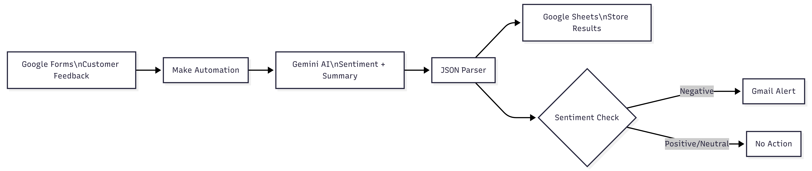
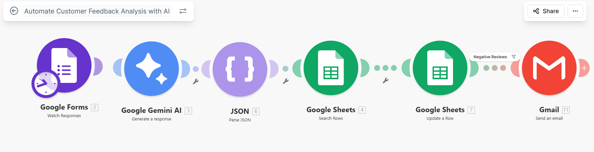

# Automated Feedback Analysis Workflow (Make)

AI-powered system that analyzes customer feedback in real time and alerts teams to critical issues.

## 🧠Problem

Businesses receive large volumes of customer feedback, but manual review is slow, inconsistent, and often delayed. This leads to missed critical issues and poor customer experience.

## 💡Solution

This workflow automates the analysis of customer feedback using AI to:
- Collects and analyzes customer responses
- Classifies sentiment (Positive / Neutral / Negative)
- Summarizes feedback automatically
- Sends email alerts for negative sentiment

## ⚙️Workflow

1. Customer submits feedback (Google Forms)
2. Triggers the workflow
3. Gemini AI analyzes sentiment and extracts insights
4. Results are stored in Google Sheets
5. Negative feedback triggers Gmail alert ( triggers Slack alert)

## 🏗️Architecture

## 🛠️Tools Used

- Make (workflow automation)
- GemeniAI API (NLP processing)
- Google Sheets (data storage)
- Gmail (notifications)

## 📊 Results / Business Impact (CRITICAL)

- ⏱️ Reduced manual review time by 80%
- ⚡ Instant detection of negative feedback
- 📈 Improved response time to customer issues

## 📥 Sample Input / Output

   Sample Input
  
  "The service was slow and the staff was rude."
  
   Sample Output
  
  - Sentiment: Negative  
  - Keywords: slow service, rude staff  
  - Summary: Customer dissatisfied with service speed and staff behavior

## 📸Screenshots

