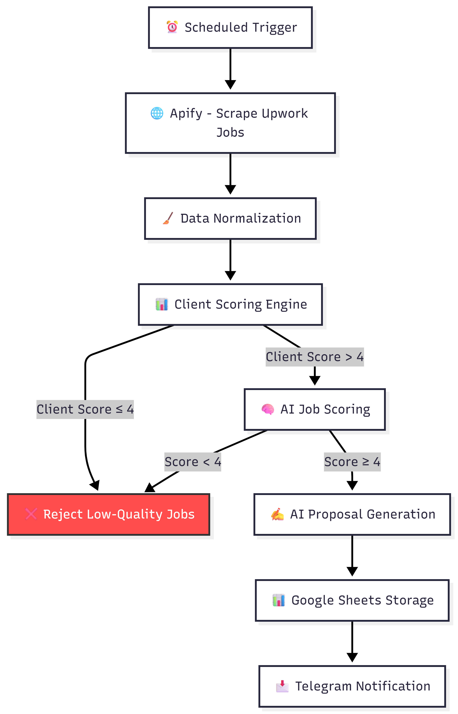
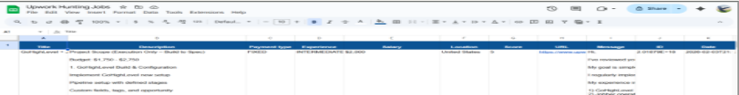

## 🤖 Upwork Job Hunt & Proposal Automation (n8n)

      
 
 <b>Automating job discovery, client scoring, and AI-powered proposal generation</b>  Turning freelance job hunting into a scalable, data-driven system 

## 📌 Overview

This project automates the **entire Upwork job acquisition pipeline**—from job discovery to proposal generation—using **n8n workflows, AI, and structured scoring logic.**

Instead of manually searching and applying to jobs, the system identifies **high-quality opportunities**, scores them intelligently, and generates **tailored proposals automatically**.

## 🎯 Business Problem

Freelance job hunting is inefficient and inconsistent:

- ⏳ Time-consuming manual job searches
- 🔍 Repetitive job and client evaluation
- ❌ Inconsistent decision-making
- ✍️ Manual proposal writing
- 📉 Missed high-quality opportunities

**Goal:**

Build a system that focuses only on **high-value, high-fit jobs** and automates the rest.

## 💡 Solution Architecture
🔄 End-to-End Workflow (Mermaid)

## 🧠 Key Features

**🌐 Automated Job Discovery**

- Scrapes Upwork jobs using Apify
- Runs on a scheduled trigger (daily automation)

**📊 Intelligent Client Scoring**

- Weighted scoring system (0–5 scale):

     - ⭐ Rating (35%)
     - 📈 Hire rate (25%)
     -💰 Spend (20%)
     - 🔁 Repeat hires (10%)
     -✔️ Payment verification (10%)

**⚠️ Quality Filtering**

- Automatically filters out low-quality clients
- Only processes jobs with client score > 4

**🧠 AI Job Relevance Scoring**

- Evaluates:

     - Skill match (automation / n8n)
     - Budget fit
     - Job type
     - Client quality

- Outputs:

     - Score (1–5)
     - Explanation for transparency

**✍️ AI Proposal Generation**

- Rewrites a high-conversion proposal template
- Customizes content per job description
- Maintains consistent tone and structure

**📊 Centralized Tracking**

- Stores approved jobs in **Google Sheets**
- Includes:

     - Job details
     - Scores
     - Generated proposal
     - Direct links

**📩 Real-Time Notifications**

- Sends alerts via Telegram
- Notifies when proposals are ready

 ## 📸 Visual Results
**🖥️ n8n Workflow**

**📊 Output Dashboard (Google Sheets)**

